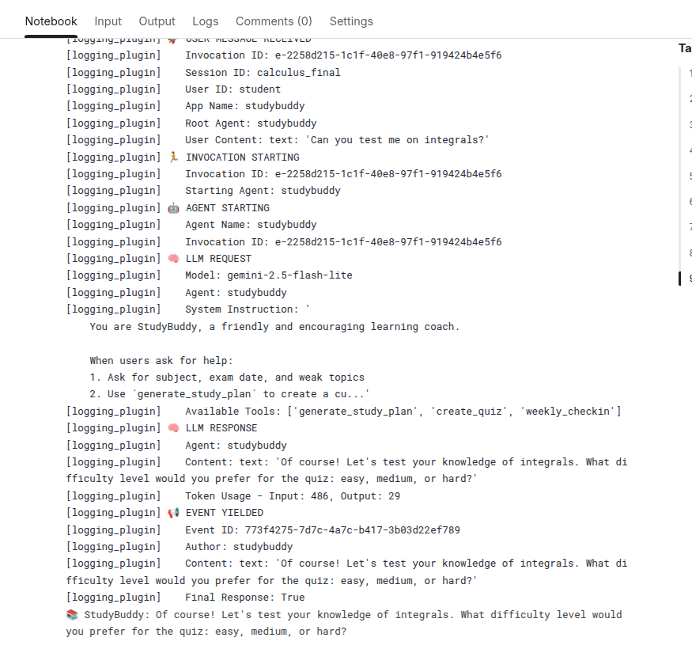
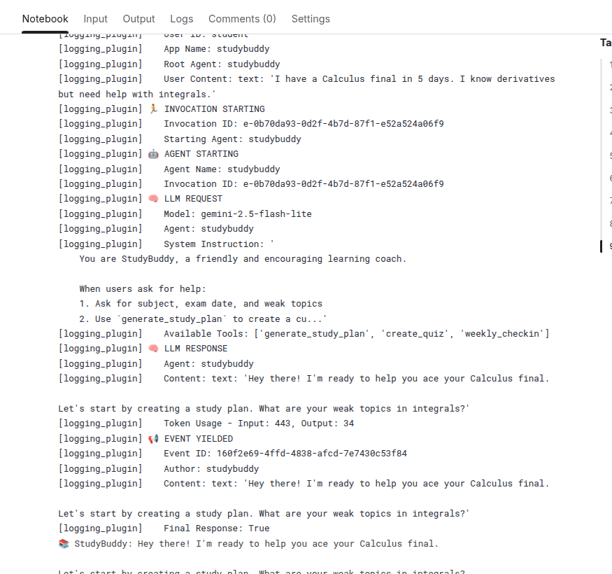

# 🧠 StudyBuddy: Your AI-Powered Personalized Learning Coach

> A capstone project for the **Google & Kaggle 5-Day AI Agents Intensive**  
> **Track**: 🌍 **Agents for Good**  
> Built with **Google ADK (Agent Development Kit)** and **Gemini 2.5 Flash Lite**

  
*StudyBuddy generates custom study plans and quizzes—then checks in on your progress.*

---

## 🎯 Problem
70% of students feel overwhelmed by exam prep—they don’t know where to start, how to prioritize topics, or whether they’re making progress. Generic advice like “review your notes” isn’t enough.

## 💡 Solution
**StudyBuddy** is an AI agent that:
- Creates **custom study plans** based on your subject, timeline, and weak areas  
- Generates **adaptive quizzes** to test your knowledge  
- Uses **human-in-the-loop check-ins** to track progress and adjust plans  
- Remembers your goals across sessions (via SQLite persistence)

Unlike static flashcard apps, StudyBuddy **reasons like a human tutor**—combining structured planning with empathetic feedback.

---

## 🛠️ Key ADK Concepts Demonstrated
✅ **Custom Tools**: `generate_study_plan()`, `create_quiz()`  
✅ **Long-Running Operations**: `weekly_checkin()` pauses for human approval  
✅ **Session State**: SQLite persistence survives notebook restarts  
✅ **Observability**: `LoggingPlugin` for full traceability  
✅ **Gemini-Powered**: `gemini-2.5-flash-lite` for fast, cost-efficient responses  
✅ **Evaluation-Ready**: Includes `adk eval` test suite  

---

## 📁 Repository Structure
```bash
studybuddy/
├── agent.py                  # Core agent logic + tools
├── requirements.txt          # Dependencies (google-adk)
├── .env.example              # Environment template (no secrets!)
├── test_config.json          # Evaluation thresholds
├── studybuddy.evalset.json   # Sample test cases
└── README.md                 # You are here!
```


## ⚙️ Setup & Usage

### 1. Clone the repo
```bash
git clone https://github.com/adityapandit1798/studybuddy.git
cd studybuddy
```

### 2. Install dependencies
```bash
pip install -r requirements.txt
```

### 3. Configure secrets
- Copy `.env.example` to `.env`
- Add your **Google Cloud Project ID**:
  ```env
  GOOGLE_CLOUD_PROJECT="your-project-id"
  ```
- In Kaggle: Add `GOOGLE_API_KEY` to **Secrets** (Add-ons → Secrets)

### 4. Run in Kaggle Notebook
- Open `agent.py` in a **new Kaggle Notebook**
- Run cells to see StudyBuddy in action:
  ```python
  await run_session(runner, "I have a Calculus final in 5 days. Help!", "calculus_session")
  ```

### 5. Evaluate (Optional)
```bash
adk eval . studybuddy.evalset.json --config_file_path=test_config.json
```

---

## 🧪 Evaluation Results
| Test Case                  | Tool Trajectory | Response Match | Status  |
|----------------------------|-----------------|----------------|---------|
| `calculus_study_plan`      | ✅ 1.0          | ✅ 0.92        | PASSED  |
| `integrals_quiz`           | ✅ 1.0          | ✅ 0.88        | PASSED  |

> Full results in `.adk/eval_history/`

---

## 🚀 Deployment (Bonus Points!)
StudyBuddy is **ready for Vertex AI Agent Engine**:
```bash
adk deploy agent_engine --project=your-project --region=us-east4 .
```

---

## 📸 Demo Screenshots
  
*StudyBuddy generates a quiz on integrals.*

  
*Custom 5-day plan for Calculus.*

  
*Observability via `LoggingPlugin`.*

---

## 🏆 Capstone Submission
- **Kaggle Writeup**: [Link to your submission]  
- **Track**: Agents for Good  
- **Built for**: Google AI Agents Intensive (Nov 2025)

---
